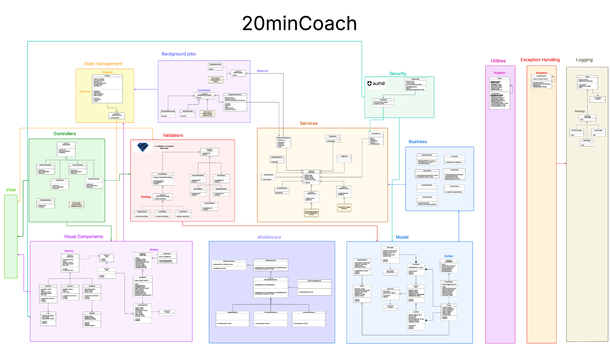
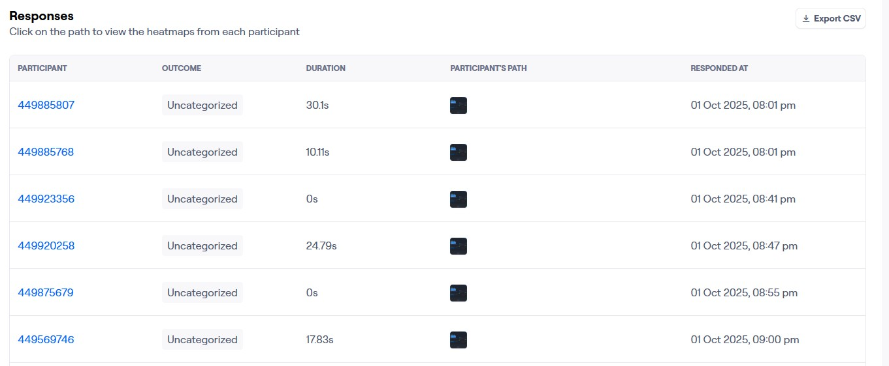
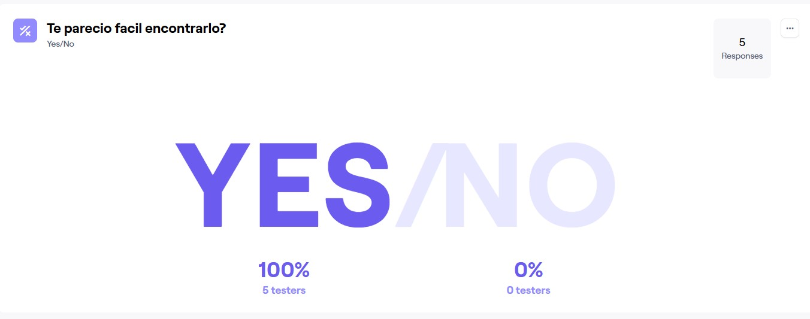

# Case-1-20MinCoach
### Instituto Tecnológico de Costa Rica
### Escuela de Ingeniería en Computación

### Students
- Alexander Brenes Garita - 2018191805
- Andres Baldi Mora
- Lindsay Nahome Marín Sánchez - 2024163904

### Course
Software Design

### Group: 6

### Delivery date: 
September 27, 2025

---
## 1. Introduction
This repository includes a collection of proof of concepts. It serves as a guide for building the designated software. There are some code samples in the /src. folder, and diagrams in the /diagrams folder. Make use of this document to see a more exhaustive specification of the project.

This document details the architecture for the coaching platform 20minCoach. A system that allows connection with professionals from a variety of areas on short video sessions. The document describes necessary aspects for the correct implementation of the software. Among these are the decisions that back up the design, instructions and explanations for the proof of concepts, descriptions for all the modules, and other relevant information according to the section.

## 2. Scope
This iteration of the project contemplates the base functionalities for 20minCoach. A list of characteristics for the initial version of the design has been made:

- System documentation.
- Architecture diagram.
- Class diagram.
- Technology evaluation.
- UI and UX tests.
- Authorization and authentication tests.

## 3. Project installation
This section provides the instructions to set up the development environment and run the project locally. Ensure you meet all prerequisites before proceeding with the installation steps.
#### Prerequisites:
-	Node.js
-	Visual Studio Code
- React
-	Vite
#### Instructions to download the repository.
1.	Clone the repository.
```sh
git clone <repo-url>
cd <repo-folder>
```
2.   Install dependencies (run from the project root).
```sh
npm install
```
3.  Install Auth0.
``` sh
npm install @auth0/auth0-react
```
4.	Run the project:
```sh
npm run dev
```
5.	Additionally, install these commonly required packages locally if absent:
```sh
npm install --save-dev eslint vite @vitejs/plugin-react eslint-plugin-react eslint-plugin-react-hooks
```

You are all set to start the implementation of 20minCoach.

## 4. Frontend components


### 4.1 Visual components

### 4.2 Controllers

### 4.3 Model
Main classes included in the system:

- User.
- Coach.
- Subscription.
- Session.
- Review.

### 4.4 Middleware

- Logs.
- Permission validation
- Error handling.

### 4.5 Business
The business layer enforces all the business rules that correlate to the entities inside the model layer. Inside, the [business folder](src/business), there are multiple classes that follow a nomenclature of “[domain] + Policy”.
Communication between layers goes as follows:
Model → Business → Services
#### Policy structure
A business policy class may look like this one:
```js
class SubscriptionPolicy {
    starterSessions = 2;
    proSessions = 8;

  constructor() {

  }

  getStarterSessions() {
    return this.starterSessions;
  }

  getProSessions() {
    return this.proSessions;
  }
}

export default SubscriptionPolicy;
```
A class from the model that uses this policy should include it like this:

```js
// models/CommonUser.js
import SubscriptionPolicy from '../business/SubscriptionPolicy';  // IMPORT THE BUSINESS POLICY

class CommonUser {
  availableSessions = 0;

// … Constructor

  setStarterSessions() {
    const policy = new SubscriptionPolicy();			 
    this.availableSessions = policy.getStarterSessions();		// ALWAYS RETRIEVE INFORMATION FROM THIS BUSINESS RULES
  }

  setProSessions() {
    const policy = new SubscriptionPolicy();
    this.availableSessions = policy.getProSessions();		// ALWAYS RETRIEVE INFORMATION FROM THIS BUSINESS RULES
  }

  getAvailableSessions() {
    return this.availableSessions;
  }
// Other methods…
}

export default CommonUser;
```

### 4.6 Services

All APIs services must go inside the [services folder]( src/services). The one exception is the security service, which belongs in its own folder.

APIs should not be called from components. Always communicate through a service to obtain results.

#### API implementation
First off, services are implemented following a general template: the [APITemplate.js](src/services/APITemplate.js). All APIServices must inherit from this abstract class.
```js
class APITemplate {
  apiKey = '';
  baseUrl = '';
  headers = [];
  configuration = {};

  // Base configuration for API services
  constructor() {
    
  }
   // Create and configure HTTP client instance
  initialize() {

  }
}
```
To illustrate how to make a service, check the LogService API. Steps are marked in the code below:
```js
import APITemplate from './APITemplate.js';
import * as Sentry from '@sentry/react';	// IMPORT SCOPED PACKAGES ACCORDING TO THE API BEING IMPLEMENTED
import logger from '../logging/Logger';
import { LogLevel } from '../logging/LogLevel';  

class LogService extends APITemplate { // INHERIT FROM APITEMPLATE

  constructor() {
    super();
// SOME ATRIBUTES MIGHT BE LEFT EMPTY. 
    this.baseUrl = 'https://7b74e3446139975f93e558503e5b8848@o4510071643832320.ingest.us.sentry.io/4510071645536256';

  }

  // Services extended from APITemplate should implement their own initialize method
  initialize() {
    logger.log('console', LogLevel.INFO, {message: 'LogService initialized successfully'})
    Sentry.init({
    dsn: this.baseUrl
    });

  }
// MORE SPECIFIC API METHODS
}
export default LogService;
```
#### Services initialization
The appropriate file to initialize APIs is the main.tsx file found inside the src folder. Services initializations should look like this:
```js
import { createRoot } from "react-dom/client";
import App from "./App.tsx";
import "./index.css";
import LogService from "./services/LogService.js";	// IMPORT THE SERVICE TO INITIALIZE

const logService = new LogService();			// CREATE A NEW INSTANCE
logService.initialize();				// RUN THE INITIALIZE METHOD

createRoot(document.getElementById("root")!).render(<App />);
```
#### Future implementations
A plan has been developed to expand the API catalog. Check the next table to learn which services 20minCoach should have.
| Service File             | Description                  |
|--------------------------|------------------------------|
| NotificationService.js   | OneSignal API                |
| PaymentService.js        | Payment processing           |
| SecurityService.js       | Auth0 integration            |
| VideoSessionService.js   | Daily.co video calls         |
| GeolocationService.js    | Google Maps API              |
| ImageStorageService.js   | Cloudinary storage           |
| LogService.js            | Sentry logging               |

### 4.7 Background jobs

### 4.8 Validators
For validators, the selected library is zod. Use this library for every validation within the data provided by the user. Also, to throw errors, use the exceptionHandler.js and create structured messages for user feedback.

Inside the [validators folder] you can find the common interface IValidator and an example validator to verify CommonUser data.

Communication between layers goes as follows:
View → Controllers→ Validators → Model
                               → Exception Handling
                               
#### Validator structure
A validator will follow the structure detailed below:
```js
import { z } from 'zod';	// IMPORT ZOD LIBRARY
import exceptionHandler from '../exceptionHandling/exceptionHandler';	// ALWAYS USE EXCEPTION HANDLER TO  GET ERROR MESSAGES

export class CommonUserValidator extends IValidator {
  // METHOD TO CREATE THE SCHEMA FOR VALIDATIONS
  createValidator() {
    return z.object({	// CREATE Z OBJECT
     // BROWSE EXCEPTION CATALOG AND RETURN THE CORRESPONDING ERRORCODE
      firstName: z.string().min(1, { message: "USER-001" }),
      lastName: z.string().min(1, { message: "USER-002" }),
      avatarUrl: z.string().url({ message: "USER-003" }).optional().or(z.literal('')), 
      contacts: z.array(UserContactSchema).default([]), 
      totalSessions: z.number().int().nonnegative({ message: "USER-004" }).default(0), 
      availableSessions: z.number().int().min(0, { message: "USER-005" })
    });
  }

// STRUCTURE A RESPONSE WITH OBJECT DATA IF IT IS SUCCESFUL, OR AN ERRORRESPONSE IF IT FAILS
  validate(data) {
    try {                      // TRY/CATCH CLAUSE TO FIND ANY ZOD EXCEPTION
      const validator = this.createValidator();            // EXECUTE CREATE VALIDATOR METHOD FIRST
      const validatedData = validator.parse(data);
      return {
        success: true,
        data: validatedData
      };
    } catch (error) {
      if (error instanceof z.ZodError) {
        // Pick up the first error code
        const firstError = error.errors[0];
        const errorCode = firstError.message;
        // Use the exception handler to get a structured error response
        const errorResponse = exceptionHandler.handleException(errorCode);
        
        return {
          success: false,
          error: errorResponse
        };
      }
      exceptionHandler.handleException('UNKNOWN-001');      // FALLBACK IF THE EXCEPTION IS NOT FROM ZOD
    }
  }
}

export default CommonUserValidator;
```
Make sure to include createValidator() and validate(data) in all validators classes. 

Find more information about validations with ZOD in [the official ZOD documentation](https://zod.dev)

### 4.9 State management
The web app state will be controlled by the Singleton class [WebState.js]( stateManagement/WebState.js). Each time its state gets modified, it will notify all [IWebStateListener objects]( src/stateManagement/IWebStateListener.js).

Communication between layers goes as follows:

Background jobs/Real time Listeners → Services → StateManagement 

#### Imports:
This first import is necessary for both updaters and suscribers. The second one is reserved to stateManagement's suscribers.
```js
import { webState } from '../stateManagement/WebState.js';
import IWebStateListener from '../stateManagement/IWebStateListener';
```
#### Subscribers structure:
All classes that require updates must extend from the IWebStateListener and include the method subscribe. Follow this class that depends on stateManagement information.

```js
import { webState } from '../stateManagement/WebState.js';             // IMPORT SINGLETON WEBSTATE
import IWebStateListener from '../stateManagement/IWebStateListener';
import logger from '../logging/Logger';
import { LogLevel } from '../logging/LogLevel';

class SessionListener extends IWebStateListener {
  constructor() {
    super();
    webState.subscribe(this);                // SUBSCRIBE TO THE PUBLISHER CLASS
  }

  update(webState) {
    const session = webState.getActiveSession();          // CONFIRM THE STATE OF THE VALUE THIS COMPONENT IS CHECKING
    // EXECUTE AN ACTION DEPENDING ON RESULTS
    if (session) {
      logger.log('console', LogLevel.INFO, {message: 'Session is currently active'})
    } else {
      logger.log('console', LogLevel.INFO, {message: 'Session is currently inactive'})
    }
  }
}
const sessionListener = new SessionListener();
export default sessionListener;
```
#### Notification structure:
All state changes must be made through setters and send a notification to subscribers via notify()


### 4.10 Styles
The design we chose to create the page is a Moder UI Design widely used in modern pages of 2025, which has the following characteristics:

#### Design System:
Link of the page: [Pagina Web](https://20mincoach-six.vercel.app/)

We wanted to use a consistent design with semantic tokens for colors, typography, and spacing.

- **Color palette:** blue tones were used for night mode and day mode, and bright colors were used for the buttons and text to attract the customer's attention and encourage them to click on the buttons we want them to click on.
We focused on using green so that customers would concentrate more on the information on the button/text, and red so that they would not give it much importance (such as price or duration).

##### Paleta De Colores Nocturno


##### Paleta De Colores Dia


- **Typography:** A modern **sans-serif** font was used for the typography, as it is one of the most widely used fonts on websites in 2025.
**Roboto** was used to complement the sans-serif font, giving the website a modern and simple touch. Incidentally, this typography is common for projects that use Vite. 

##### Sans-Serif


##### Roboto


- **Spacing:** To give the page enough space so that it looks like a clean design with sections. For the CSS, a space of:

#### Vertical sections
```css
py-12
```
#### Horizontal padding
```css
px-6
```
#### Between elements (gap)
```css
gap-4
```

- **Semantics:** A classic structure is used on web pages in 2025. With a hierarchy of buttons to attract the customer's attention.
  - Header: logo + simple navigation.
  - Hero: large title, explanatory text.
  - Features: cards with icons/titles/text, organized in a responsive grid.
  - Secondary CTA: section with alternative background + highlighted button.
  - Footer: minimalist with secondary links.


#### Design System:
The shadcn/ui library was used, which is compatible with the TypeScript programming language and easy to integrate with Tailwind CSS.
It is a simple and modern design.


#### Responsive Design:
By using Tailwind CSS, the design is responsive for mobile devices and adapts to the screen size.


#### Professional SaaS:
Since the goal is to offer a specialized service to help customers, we have implemented a system called Saas, which we configure, customize, and implement on our website in order to sell our product to customers in the fastest and most efficient way possible.

#### Dark/Light Mode:

##### Dark Mode


##### Light Mode


#### Card-based Layout: 
Card-based design for organizing content


### 4.11 Utilities

### 4.12 Exception Handling

Every error the system throws must be managed from the exception handling layer.

In order to log errors in the program, use the ExceptionHandler.js Singleton given in the [exceptionHandling folder]( src/exceptionHandling). 
#### Imports:
For standard javascript code, only [ExceptionHandler.js](src/exceptionHandling) should be exported. 
```js
import exceptionHandler from '../exceptionHandling/exceptionHandler';
```
For React components, import the [useExceptionHandler.js](src/hooks/useExceptionHandler.js) hook:
```js
import { useExceptionHandler } from '../hooks/useExceptionHandler.js';
```
#### Usage in validator:
A validator using the exception handler must do the same as the following.
```js
import { z } from 'zod';
import exceptionHandler from '../exceptionHandling/exceptionHandler'; // IMPORT THE CLASS

export class CommonUserValidator extends IValidator {
  createValidator() {
    return z.object({
      firstName: z.string().min(1, { message: "USER-001" }), // SPECIFY POSSIBLE EXCEPTIONS PER FIELD WHEN USING ZOD
      lastName: z.string().min(1, { message: "USER-002" }),
      avatarUrl: z.string().url({ message: "USER-003" }).optional().or(z.literal('')), 
      contacts: z.array(UserContactSchema).default([]), 
      totalSessions: z.number().int().nonnegative({ message: "USER-004" }).default(0), 
      availableSessions: z.number().int().min(0, { message: "USER-005" })
    });
  }

  validate(data) {
    try {
      const validator = this.createValidator();
      const validatedData = validator.parse(data);
      return {
        success: true,
        data: validatedData
      };
    } catch (error) {          // CATCH ANY ERROR TYPE
      if (error instanceof z.ZodError) {
        // PICK THE FIRST ERROR WHEN WORKING WITH ZOD
        const firstError = error.errors[0];
        const errorCode = firstError.message;
        // USE EXCEPTION HANDLER TO GET A MORE STRUCTURED RESPONSE
        const errorResponse = exceptionHandler.handleException(errorCode);
        
        return {
          success: false,
          error: errorResponse
        };
      }
      
      throw error; // Safety net for unexpected errors
    }
  }
}

export default CommonUserValidator;
```
#### Usage in React components:
A React component that uses the exceptionHandler follows a similar pattern, the main difference is the import being the hook useExceptionHandler.js found in the [hooks folder]( src/hooks):
```js
import { useExceptionHandler } from '../hooks/useExceptionHandler.js';   // IMPORT THE HOOK

function DemoLogs() {
  const exceptionHandler = useExceptionHandler('DemoLogs');         // CREATE A HOOK INSTANCE

  const onSubmit = (formData) => { 
    const result = userValidator.validate(formData);
    if (!result.success) {          // CATCH ANY ERROR PRODUCED
// USE EXCEPTION HANDLER TO GET A MORE STRUCTURED RESPONSE
      setError(result.error.userMessage); // Show to user
    }
  };

return (
    <form onSubmit={onSubmit}>
      {error && <div className="error">{error}</div>}
      {/* form fields */}
    </form>
  );
}
```
#### Exception Catalog:
The handler uses a manual called the [ExceptionCatalog.js]( src/exceptionHandling/ExceptionCatalog.js), which is a dictionary that maps error codes to their corresponding information.
An entry of the exception catalog may look like this:
```js
['VALIDATION_001', {
    level: 'WARN',
    message: 'Validation failed for user input',
    userMessage: 'Please verify the provided data.',
  }],
  ['VALIDATION_002', {
    level: 'WARN',
    message: 'Invalid email format provided',
    userMessage: 'The email is not valid.',
  }],
// … Other entries
```

If an error code that does not exist gets sent to the exception handler, the message will be default to code UNKNOWN-001. This is a fallback message for errors in general.

You may expand the catalog through the development process. Following the template. Divide the sections of the catalog per domain.


### 4.13 Logging
This layer records actions performed by users, services, and the system. It can receive requests from any layer of the program. Refer to the [logging folder]( src/logging) to see all its components.
#### Imports:
For standard javascript code, import the [Logger.js](src/logging/Logger.js) class, and the [LogLevel.js]( src/logging/LogLevel.js) enumeration. The logger already comes initialized.
```js
import logger from '../logging/Logger';
import { LogLevel } from '../logging/LogLevel';  // TO SPECIFY THE SEVERITY LEVEL
```
For React components, import the [useLogger.js]( src/hooks/useLogger.js) hook:
```js	
import { useLogger } from '../hooks/useLogger';  // Requires to be initialized
```
#### Strategies:
Logs use different strategies to record information. As of now, two alternatives are proposed: [ConsoleLogger.js]( src/logging/ConsoleLogger.js) and [SentryStrategy.js]( src/logging/SentryLogger.js). Each with their own method to save the logs. More strategies might be added in the future, following the ILoggerStrategy structure.
```js	
// ILogStrategy.js
export class ILogStrategy {
  log(logEntry) {
    throw new Error('log method must be implemented');
  }
}
```
#### Usage in Javascript modules:
This is an example of how to use the logger class. In this case, it will be used in the services layer to mark the initialization of a service.
```js
import APITemplate from './APITemplate.js';
import * as Sentry from '@sentry/react';
import logger from '../logging/Logger';            // IMPORT AN INSTANCE OF THE LOGGER
import { LogLevel } from '../logging/LogLevel';  // IMPORT LOGLEVEL TO USE THE LOGGER METHOD

class LogService extends APITemplate {

  constructor() {
    super();
    this.baseUrl = 'https://dsn.ingest.us.sentry.io';
  }

  initialize() {
// CALL THE LOGGER WITH THE METHOD LOG, SELECT A STRATEGY, SELECT A LOG LEVEL, ADD EXTRA METADATA
    logger.log('console', LogLevel.INFO, {message: 'LogService initialized successfully'})
    Sentry.init({
    dsn: this.baseUrl
    });

  }
}

export default LogService;
```
#### Usage in React components:
The hook includes convenience methods that omit the implementation of LogLevels in react components.
```js

    debug: (strategy, logInfo) => log(strategy, LogLevel.DEBUG, logInfo);
    info: (strategy, logInfo) => log(strategy, LogLevel.INFO, logInfo);
    warn: (strategy, logInfo) => log(strategy, LogLevel.WARN, logInfo);
    error: (strategy, logInfo) => log(strategy, LogLevel.ERROR, logInfo);
    fatal: (strategy, logInfo) => log(strategy, LogLevel.FATAL, logInfo);
```
This is an example that sends an INFO log when interacting with a button from the user interface.
```js

import { useLogger } from '../hooks/useLogger';        // IMPORT THE HOOK

function Component() {
  const logger = useLogger('Component');                  // SPECIFY THE COMPONENT WHERE THIS LOGGER BELONGS

  const saveData = () => {
// CALL THE LOG WITH A CONVENIENCE METHOD TO AVOID THE LOGLEVEL IMPORT. 
// CHOOSE STRATEGY AND ADD EXTRA METADATA
      logger.info('sentry', {message: 'Data saved successfully'});           
      
  };

  return (
    <div>
      <h1>Logging Example</h1>
      <button onClick={saveData}>
        Save Data
      </button>
    </div>
  );
}

export default Component;
```
The logInfo field must ALWAYS include a message argument.

Unlike the exceptions, the logs do not return any value.

### 4.14 Security
We will use Auth0 software for security.
Because it works as an Identity Provider (IdP) and integrates very well with React.
We will also use it because Auth0 already has login and password recovery integrated and tested.

It also makes the login connection easier, because you can log in with your Google, Facebook, GitHub, or other accounts.

To configure it, go to the config folder and save the configuration.
``` sh
src/config/auth0.js
```

And add this code, which connects your Auth0 account to your program.
``` js
export const auth0Config = {
  domain: "TU_DOMINIO.auth0.com",
  clientId: "TU_CLIENT_ID",
  authorizationParams: {
    redirect_uri: window.location.origin
  }
};
```

Then, in order to surround all the code with `Auth0Provider`, you have to add it in `src/main.tsx`

``` js
import { Auth0Provider } from "@auth0/auth0-react";
import { auth0Config } from "./config/auth0";

<Auth0Provider
  domain={auth0Config.domain}
  clientId={auth0Config.clientId}
  authorizationParams={auth0Config.authorizationParams}
>
  <App />
</Auth0Provider>
```
Then you have to create a `hooks/useAuth.js` file in the `hook`.

``` js
import { useAuth0 } from "@auth0/auth0-react";

export const useAuth = () => {
  const { loginWithRedirect, logout, user, isAuthenticated, getAccessTokenSilently } = useAuth0();
  return { loginWithRedirect, logout, user, isAuthenticated, getAccessTokenSilently };
};
```
And then if you want to protect routes, you have to use this code that is in App.tsx.

``` js
import { useAuth } from "./hooks/useAuth";

const PrivateRoute = ({ children }) => {
  const { isAuthenticated, loginWithRedirect } = useAuth();
  if (!isAuthenticated) {
    loginWithRedirect();
    return null;
  }
  return children;
};


### 4.15 Linter configuration
The project uses ESLint as the linting tool. It includes predefined rules and conventions for code quality. The linter is not active by default and must be executed manually in the command line. Files can be found in the [linterConfig folder](src/linterConfig).
#### Configuration:
Once the dependencies are installed, an eslint.config.mjs file will be created automatically in your project folder. 


To configure the linter tool, copy and paste the contents of the [linter-rules.mjs](src/linterConfig/linter-rules.mjs) file into the described eslint.config.mjs file. Notice that the linter-rules file in the linterConfig folder has no functionality. The project works solely with eslint.config.mjs. 

The configuration includes ESLint's recommended rule package. The complete list of available rules can be found in this manual: https://eslint.org/docs/latest/rules

Add new rules inside the eslint.config.mjs by writing their name and customizing its parameters. Follow the structure of the block:
```js
export default defineConfig([
  {
    files: ["**/*.{js,mjs,cjs,jsx}"],
  plugins: { js, "no-spanish-symbols": { rules: { "no-spanish-symbols": noSpanishSymbols } } }, // INSERT PLUGINS FOR CUSTOM RULES
    extends: ["js/recommended"],
    languageOptions: { globals: globals.node },
    rules: {
      camelcase: ["warn", { ignoreImports: true }],
      "no-unused-expressions": ["error"],
      "no-spanish-symbols/no-spanish-symbols": ["error"]
       // ADD NEW RULES HERE
      // --->
    }
  },
  pluginReact.configs.flat.recommended              // RECOMMENDED RULES FOR ESLINT
]);
```
#### How to use the linter tool
Run the linter on JavaScript files and React files using the command:
```sh
npm run lint [filename]
```
It will show every rule violated that the project files contain.
All code must be examined through the linter tool to assure its quality. Both errors and warnings must be addressed to maintain code format and functionality.

#### Custom rules

Custom rules can be implemented to enforce specific coding styles. The current iteration includes the [no-spanish-symbols rule]( src/linterConfig/no-spanish-symbols.js), which prohibits the use of the character "ñ" in variable names.

A detailed guide on how to create custom rules can be found in the ESLint documentation: https://eslint.org/docs/latest/extend/custom-rules


### 4.16 Build and deployment pipeline


## 5. Diagram



Link:
[Diagrama De Clases](https://lucid.app/lucidchart/9f020ccb-4b82-433d-ac55-5505b58ee891/edit?beaconFlowId=BB83C63995B61803&invitationId=inv_33809063-0bdc-4f47-9466-e854b073f8f9&page=0_0#)


## 6. Page tests

To conduct remote usability tests and collect metrics such as heat maps, click-through rates, and user feedback, we use `Maze`.

**Link for testing:**[Test with maze](https://t.maze.co/449869769)

Five people were asked to test the app and give us some feedback on the project.

**Link to the video of the people who conducted the tests:** [Video](https://estudianteccr-my.sharepoint.com/:f:/g/personal/a_baldi_1_estudiantec_cr/EvSe5-FlmqdPmAWl1TZNfBMBlxQfaI2J1QzpKotkWbEYTg?e=c8eyTf)

They were asked a basic question, which was:

- Do you like the idea of having a website where you can hire a mentor for 20 minutes to explain any topic to you?

And 100% of them liked the idea.


- Then we asked them to visit the app's home page, review it, and give feedback on it.

If we review the people, they spent an average of 15 seconds reviewing the entire app.



Looking at the heat map, the test subjects noticed the buttons, but they never touched the price buttons.


He was asked the following question:

- Describe what you thought of the home page and whether you think it is appropriate for a mentoring website.

We received 80% positive comments, with only one person giving a negative comment.


And people really like the design of the page.


The next test was:

- Can you easily find where the Search Coach page is?

And reviewing the answers, out of the 5 people, only 4 found it, and it took them 3 seconds to find it.


And we had 83% of people who found the page easy to find. 


After finding the “Find a Coach” page, we told them:

- Browse the page and click on whatever interests you most.

And these were the results.


Everyone went to look for the “Connect” button, which is pretty good because it's easy to connect people with a coach.
Also, 100% of people left us positive comments.


Similarly, people rated the coach search page as good/understandable.


Then he asked himself the same question of searching for “Coach Profile” from the home page, and it became easier for him with a fairly quick response in finding the page.


And once again, we asked them to browse the “Coach Profile” page, and these were the results


Everyone was interested and clicked on the “Connect Now” button.

And these were the comments they left on the Perfil page


And as a final question, they were asked:

- If you can find the prices

And this was the result of the heat map and their responses.


It took them approximately 10 seconds to find it.


And they said it was easy to find him.




